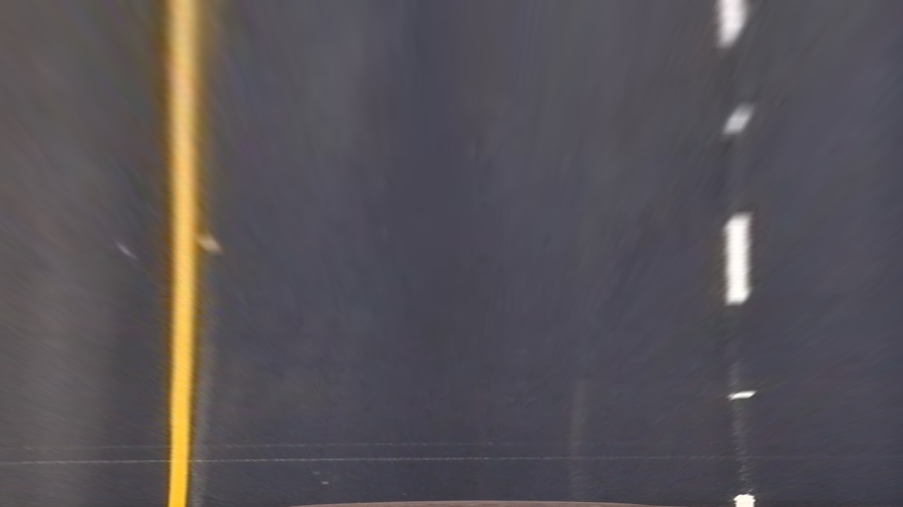

## Advanced Lane Finding Project

The code for this project is in the IPython notebook located in "./Advanced lane finding.ipynb".

## Camera Calibration

I set the depth of the object points of the chessboard at z = 0 and the coordinates (x, y) are 9 by 6 mesh grid.

To find the image point, I called the `cv2.findChessboardCorners`. The tricky part is that some calibration images do not include all 9x6 = 54 points. The findChessboardCorners function will fail in those images. Therefore, I use the images with all points for calibration and the other images for testing.

The `cv2.calibrateCamera()` computes the parameters for removing distortion. An undistorted image and its original image are shown below.

 
 

### Pipeline (single image: test_images/test5.jpg)
The entire pipeline has 4 steps. I use `test_images/test5.jpg` as an example.
1. Correct distortion with cv2.undistort
2. Convert image to binary feature image
3. Perspective transform
4. Search for lane pixels and fit them in the binary feature image
5. Compute curvature and distance to center

#### 1. & 2. Undistort and binary feature map
After the first distortion correction step with `cv2.undistort` and the calibration parameters, we can convert the RGB image to a binary feature image using a combination of gradient and color space thresholding. The code is in the 5th cell in the notebook. The colored binary feature image is shown below. Blue colored pixels have high S value in the HSL color space and the green pixels have high gradient.  

#### 3. Perspective transform

To compute the perspective transform, I marked four points in `test_images/straight_lines1.jpg` as shown below.

This resulted in the following source and destination points:

| Source        | Destination   |
|:-------------:|:-------------:|
| 710, 464      | 1055, 0        |
| 1055, 689      | 1055, 720      |
| 248, 689     | 248, 720      |
| 574, 464      | 248, 0        |

I compute the perspective transform matrix using `cv2.getPerspectiveTransform()` and use `cv2.warpPerspective` to compute the following bird eye view image.

The warped feature map if test2.jpg is shown below.

#### 4. Fitting

From the warped binary feature, I first search the pixels of the lane using the sliding window method as describe in the lecture. I increase the number of rows for computing the initial histogram for better initial estimate of the lane position. The fitting result of test2.jpg is shown below.

#### 5. Curvature and distance to center

To combine the curvature of left and right lane, I combine the binary feature pixels of the left and right lane together and do another polynomial fitting. The advantage of this approach to directly averaging the coefficient of the two polynomial is that the combined fitting is more robust to missing lane on one side.

I follow the equation in the lecture to compute the curvature of the combined lane. The distance between the midpoint and the center of the two lanes is computed.

A visualization of the final result is shown below.

---

### Pipeline (video)

Here's a [link to my video result](./project_video_out_final.mp4)

---

### Discussion

The bottleneck of the current pipeline is the binary feature map. The current simple gradient and color space thresholding method is not robust to changes of shadow and false edges between the lanes in the `challenge_video.mp4`. One possible way to address this issue is use convolutional network to learn better feature for lane detection. 
